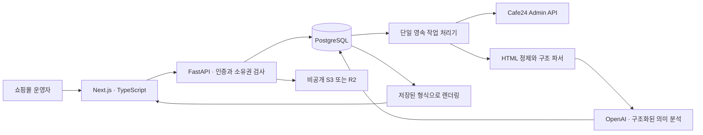

# 엣더룸 상품 작업실 — 설계와 구현

작성 기준: 2026-09-10. 첨부 요청의 26개 항목 순서로 정리한다. UI는 한국어 운영 화면, 아래 문서는 설치·유지보수 담당자용이다.

## 1. 전체 시스템 아키텍처

V1은 운영자 1명·쇼핑몰 1개를 배포 단위로 한다. 테이블과 조회에는 user_id 격리가 포함되지만, 다중 조직 가입·초대 서비스는 제공하지 않는다. 앱 로그인과 카페24 쇼핑몰 승인은 별개다. 카페24 비밀번호는 입력받거나 저장하지 않는다.

분석·초안 생성·등록은 jobs에 저장하고 별도 worker 프로세스가 수행한다. 화면 종료 후에도 작업을 지속한다. worker는 PostgreSQL advisory lock으로 1개만 실행한다. 여러 웹 요청은 DB 상태와 행 잠금으로 보호한다. 개발용 SQLite에서는 worker 파일 잠금을 사용한다.

운영 구성은 Next.js + FastAPI + PostgreSQL + S3/R2다. 외부 키가 없는 빠른 체험에만 SQLite와 로컬 파일을 허용한다. DEMO_MODE=true에서는 OpenAI와 카페24 등록을 호출하지 않는다.

## 2. 사용자 플로우

1. 작업실 로그인.
2. 관리자에게 승인된 형식이 있는지 확인.
3. 새 상품 작업 생성, 사진 여러 장 업로드.
4. 판매가·공급가·소재·사이즈 입력.
5. 초안 생성, 사진 용도·대표 사진·순서 확인.
6. 상품명·설명·카테고리·검색 정보 수정 및 저장.
7. 미리보기와 차이 안내 확인, 검수 완료.
8. 등록 버튼, 유사 상품이 있으면 기존 상품 확인 후 선택.
9. 등록 결과 확인. 실패한 단계만 재개.

수정하면 revision이 증가하고 검수가 취소된다. 등록 요청은 검수한 revision과 같아야 한다. 최초 등록 상태는 항상 진열 F, 판매 F다.

## 3. 관리자 플로우

연결 버튼 → 카페24 로그인·승인 → 생성일 기준 최근 30개 자동 분석 → DRAFT 미리보기 → 사용자 승인 → ACTIVE.

운영 설정에서 소재·사이즈 필수 여부, 내부 상품군과 실제 쇼핑몰 분류의 연결, 상품명·설명 규칙, 금지 표현, 공통 구매 안내, 검색 설명 규칙을 관리한다. 관리자 기준과 분석 기준의 우선순위를 선택할 수 있다. 정확성 제한과 금지 표현은 우선순위에 관계없이 적용한다.

수동 재분석은 새 DRAFT 버전을 만들고, 기존 버전을 계속 사용한다. 사용자는 새 순서·설명 길이를 비교해 적용하거나 기존 형식을 유지한다.

## 4. Database Schema

`docs/schema.sql`에 PostgreSQL DDL 전체를 제공한다. `backend/migrations/versions/0001_initial.py`는 현재 모델을 다시 불러오지 않는 고정된 최초 마이그레이션이다.

| 테이블 | 핵심 내용 |
|---|---|
| users | 운영자, 역할 |
| login_sessions | 세션 해시, 만료 시각 |
| oauth_states | 일회용 승인 요청, 요청 세션 바인딩 |
| cafe24_accounts | 쇼핑몰, 암호화된 접근·갱신 정보, 만료 |
| brand_settings | 작성 규칙, 상품군 연결, 쇼핑몰 분류 캐시 |
| source_products | 생성일, 상품명, 정제된 구조, 의미 슬롯, 중복 비교 해시 |
| template_profiles | 버전·상태·분석 집계·전체 형식·상품군별 형식·스타일 그룹 |
| products | 사용자 입력과 초안, 검수 revision, 고정된 형식 snapshot, 등록 체크포인트 |
| product_images | 파일 위치, SHA-256, pHash, 용도, 신뢰도, 확인 여부, 순서 |
| ai_generations | 이미지 ID와 확인된 입력, 구조화된 결과, 모델 |
| jobs | 작업 유형·대상·진행 상태·결과 안내 |

JSON은 PostgreSQL에서 JSONB로 저장된다. template_profiles의 `(user_id, version)`은 유일하다. `status='ACTIVE'` 부분 유일 인덱스는 운영자별 동시 ACTIVE를 하나로 제한한다. jobs에도 동일 대상의 QUEUED/RUNNING 작업 중복을 막는 부분 유일 인덱스가 있다. 금액은 원 단위 정수다.

분석 성공·실패 수는 profile.analysis 안에 저장한다. 원본 변수 값을 포함할 수 있는 source_products와 실제 재사용용 template_profiles를 분리한다. template 안에는 기존 상품 이미지 주소·가격·소재·사이즈·고유 설명을 보관하지 않는다.

## 5. Cafe24 OAuth 설계

서버에 쇼핑몰 ID·앱 자격정보·등록된 반환 주소를 배포 담당자가 설정한다. 사용자는 연결 버튼만 누른다. 한 쇼핑몰용 V1이므로 쇼핑몰 ID를 화면에 직접 입력할 필요가 없다. 여러 쇼핑몰에 판매할 SaaS로 확장할 때는 앱 설치 진입 문맥과 서명 검증을 추가해야 한다.

서버에서 충분히 긴 무작위 state를 만들고 해시만 저장한다. state는 5분 만료·일회 사용이며 로그인 세션과 사용자에 묶인다. callback에서 state, 세션, 사용자, 만료를 검증한 뒤 토큰을 교환한다. HTTP 요청에서는 Basic 인증과 form 인코딩을 사용한다.

권한: mall.read_product, mall.write_product, mall.read_category. 서버만 토큰을 취급한다. Fernet 인증 암호화로 접근·갱신 토큰을 저장한다. 암호화 키는 DB 밖 환경변수/비밀 저장소에서 관리한다. 만료 2분 전 갱신하며 account 행 잠금으로 회전 경합을 제어한다. 카페24의 시간대 없는 만료 시각은 한국 시간으로 해석한다.

일반 POST/PUT/DELETE는 설정된 프런트엔드 Origin과 일치해야 한다. 앱 세션 쿠키는 HttpOnly, SameSite=Lax이며 운영 환경에서는 Secure다. OAuth 쿼리가 접근 로그에 남지 않도록 운영 서버·프록시 로그에서 query string을 제외한다.

## 6. 최근 30개 상품 조회 로직

`GET /api/v2/admin/products`에 `sort=created_date`, `order=desc`, `limit=30`, `offset=0`을 명시한다. updated_date는 사용하지 않는다. 받은 대상의 생성일을 기준으로 다시 정렬한다.

목록에 들어온 상품마다 상세를 개별 조회한다. 조회·파싱·의미 분석 실패는 해당 상품만 제외한다. 30개 중 3개 실패 시 27개가 Global 분석 모수가 된다. 실패한 슬롯을 오래된 상품으로 대체하지 않는다. 상품이 30개 미만이면 받은 전체를 사용한다.

특정 내부 상품군이 3개 미만이면 최대 과거 50개 목록을 한 번 탐색한다. 이름의 내부 상품군 분류로 대상 후보를 좁힌 후, 해당 상품군에 대해서만 상세 분석하여 최대 5개까지 확보한다. AI의 상세 분류 결과를 다시 검증한다. 보충 결과는 해당 상품군 형식에만 사용하고 Global의 최근 30개 모수에 섞지 않는다. 이름으로 특정할 수 없는 과거 상품은 보수적으로 제외되므로 표본 부족 시 Global로 돌아간다.

## 7. HTML Parser 설계

BeautifulSoup으로 파싱하고 Bleach allowlist로 정제한다. 허용된 div, p, span, img, table, br, 제목·목록 태그와 구조적 속성만 남긴다. script, iframe, object, embed, form, svg, math 및 실행 요소를 제거한다. 이벤트 핸들러·javascript 주소·srcset·외부 스타일 코드는 남기지 않는다. CSS 속성은 정적 표시용 속성만 허용한다.

각 텍스트 노드와 이미지에 안정적인 슬롯 ID를 부여한다. 태그·깊이·class·정제된 inline style의 토큰 열과 텍스트 슬롯을 AI에 전달한다. 원본 상세 HTML을 AI에 파싱시키지 않는다. 원본 링크의 고유 주소와 제목도 재사용하지 않는다.

## 8. DOM 정규화 방식

텍스트 노드는 `{{t0}}` 같은 자리로, 이미지 주소는 빈 src와 이미지 슬롯으로 치환한다. 이미지 alt·고유 링크를 제거한다. class 안 숫자는 구조 비교에서 N으로 정규화한다. class 자체와 안전한 style은 렌더링용 구조에는 보존한다.

구조 비교 데이터에는 상품명 문자열, 설명 문자열, 가격·치수·소재 값, 이미지 주소가 들어가지 않는다. 의미 분석이 붙인 DESCRIPTION, SIZE, MATERIAL, NOTICE와 이미지 역할의 순서만 추가한다.

## 9. Style similarity 계산 방식

`0.8 × 태그/깊이/class/style 토큰열 유사도 + 0.2 × 의미 섹션 순서 유사도`를 사용한다. 두 유사도는 autojunk를 끈 SequenceMatcher ratio다. 콘텐츠의 값은 비교하지 않는다. 기준값 0.88은 실데이터로 조정 가능한 V1 상수이며, 서로 다른 전체 구성과 사소한 태그 차이를 구분하기 위한 휴리스틱이다.

## 10. Style clustering 알고리즘

최신 생성순으로 순회하며 새 상품이 그룹의 모든 기존 상품과 0.88 이상 유사할 때만 해당 그룹에 넣는다. 이는 대표 1개만 비교하는 방식에서 생길 수 있는 연쇄적인 그룹 확장을 억제한다. 일치 그룹이 없으면 새 그룹을 만든다. Global과 각 내부 상품군을 독립적으로 군집화한다.

## 11. Stable Style 선택 알고리즘

같은 그룹에서 3개 이상 사용되고 해당 분석 범위 최신 10개 안에 등장한 그룹만 stable 후보로 인정한다. 선택 키는 `(가장 최근 등장 순위, -최근10개 빈도, -최초 최근 등장부터 연속 횟수, -전체 빈도)`다. 최신 등장 순위는 고유 순서여서 다른 tie-breaker는 동률 확장에 대비한 기준이다. 단발 상품은 채택하지 않는다.

후보가 없으면 형식을 임의로 만들지 않고 DRAFT를 저장하되 승인 불가로 안내한다. 3개 미만 상품군은 별도 stable 형식을 만들지 못하면 Global을 사용한다.

## 12. Template Profile Schema

profile은 analysis, source_product_ids, global_template, category_templates, styles, version, status, 시각들을 포함한다.

각 template에는 정제된 html 골격, variable slots, fixed_blocks와 fixed_roles, 이미지 슬롯, section_order, description_rules, product_name_rules, image_rules, unresolved, active_style_id가 들어간다. AI 응답 스키마는 `backend/app/schemas/ai.py`에 있다.

FIXED는 NOTICE·배송·교환/반품·A/S·브랜드·범용 제목 역할 중, 같은 문구가 최소 3개 상품에서 반복되는 경우만 인정한다. 나머지는 VARIABLE 또는 확인 필요다. 표본 한 상품을 직접 참고하더라도 이미 ACTIVE에서 공통성이 확인된 문구만 가져온다.

안전한 정제 이후 원본과 모양이 달라질 수 있다. 외부 CSS, 실행 코드, 이미지로만 된 안내의 의미·문구까지 완전하게 복원하는 것은 V1 범위에서 보장하지 않는다. 원본 쇼핑몰 표본으로 승인 전 시각 검증해야 한다.

## 13. Template Version 관리

분석마다 최대 version+1로 새 DRAFT를 INSERT한다. 기존 값을 UPDATE해 분석 결과를 덮지 않는다. user 행 잠금 안에서 현재 ACTIVE를 ARCHIVED로 바꾸고 flush한 다음 새 DRAFT를 ACTIVE로 바꾼다. 두 변경은 하나의 transaction이다. DB 부분 유일 인덱스로 마지막 방어를 한다.

초안은 선택한 template_profile_id와 실제 template snapshot을 저장한다. 등록 전 현재 ACTIVE와 일치해야 한다. 형식이 바뀌면 맞추기·재검수를 요청한다. 공통 구매 안내를 운영자가 직접 지정하면 미리보기와 검수에 사용하는 snapshot에서 해당 영역에 적용한다.

## 14. 내부 상품군 구조

RING, NECKLACE, EARRING, BRACELET, PIERCING, HAIR, ETC의 enum을 사용한다. 분류 판단에 카페24 category ID를 넣지 않는다. 판단 이후 brand_settings.category_mapping으로 실제 분류와 연결한다. 분류 목록 새로고침 시 삭제된 연결은 제거한다. 신규 상품의 검수 시 실제 캐시에 존재하는 분류인지 다시 검사한다.

## 15. 신규 이미지 분석 Schema

`ImageGuess`는 id, type, confidence를 가진다. type은 MAIN_CANDIDATE, WEARING, PRODUCT, DETAIL, SIZE_REFERENCE, ETC다. confidence는 0~1.

0.85 이상은 확인 상태를 자동 적용할 수 있고, 0.60~0.85 미만은 제안하되 확인이 필요하다. 0.60 미만은 미분류로 둔다. 사용자는 사진 용도·순서·대표 사진을 언제든 수정한다. 이미 검수한 상품의 사진 변경은 검수를 취소한다.

업로드는 실제 파일 디코딩으로 JPG/PNG/WEBP를 검사한다. 장당 5MB·최대 20장·최대 3천만 픽셀을 제한한다. 원본 바이트 SHA-256과 pHash를 계산하고, 방향을 보정하고, 메타데이터를 제거한 JPEG를 저장한다.

## 16. OpenAI Structured Output

OpenAI Python SDK의 `client.responses.parse(..., text_format=PydanticModel)`을 사용한다. 입력 사진은 서버가 소유한 파일을 읽어 data URL로 전달한다. 자유로운 전체 HTML 출력은 허용하지 않는다. 모델 기본값은 이미지 입력·구조화 출력을 지원하는 gpt-4.1이며 환경변수로 교체할 수 있다.

첫 분석으로 내부 상품군을 판단한 뒤 저장된 ACTIVE의 해당 상품군 또는 Global을 선택한다. 두 번째 요청에는 선택한 이름·문체·이미지 규칙을 주어 초안을 작성한다. 첫 그룹과 두 번째 그룹이 다르면 사용자 확인 상태로 내린다. 기존 상품 30개를 다시 분석하지 않는다.

가격·정확한 소재·치수·제조국·인증·재고·옵션은 출력 스키마에 없으며 프롬프트로도 추정을 금한다. 상품명·설명 안에 흔한 소재/치수/인증 단정 표현이 들어가면 검수 단계에서 사용자 확인값과 비교해 막는다. 이 검사는 모든 자연어 허위 주장을 판별하는 보장이 아니므로 최종 사용자 검수가 필수다. 거절·불완전 응답·사진 ID 누락은 생성 실패로 처리한다.

체험 모드는 AI 호출을 하지 않으며 사진 내용을 분석했다고 표시하지 않는다. 상품명·설명은 확인 요청 문구를 넣고 사진 신뢰도는 0으로 반환한다.

## 17. Template Rendering

백엔드가 저장된 정제 골격을 다시 파싱해 같은 의미 역할의 이미지 슬롯에 새 사진을 삽입한다. 역할 내 사용자 순서를 유지하며 사진이 많으면 마지막 이미지 노드를 복제하고 적으면 남는 이미지 노드를 제거한다. 지원하지 않는 이미지 역할은 임의의 위치에 추가하지 않고 등록 전 수정하도록 한다.

텍스트는 단일 정규식 치환과 HTML escaping으로 삽입한다. 사용자가 템플릿 표현식을 입력해도 다시 평가하지 않는다. 렌더링 결과도 sanitize한다. 미리보기는 scripts·same-origin 권한이 없는 sandbox iframe과 제한된 CSP로 표시한다.

HTML을 사용자가 자유 편집하지 않으므로 wrapper와 고정 블록의 누락은 렌더러에서 방지한다. 섹션 순서·역할·설명 길이·상품명 길이를 비교한다. “배치 형식 다시 적용”은 현재 승인된 골격을 다시 적용한다. 내용 길이·사진 누락은 실제 입력을 수정하거나 차이를 검토해야 하며 임의로 글을 잘라 맞추지 않는다. 상품명 규칙의 의미 수준 검증과 픽셀 단위 원본 비교는 아직 별도 사람이 확인해야 한다.

## 18. Frontend 페이지

| 경로 | 화면 |
|---|---|
| / | 로그인, 연결 시작, 사진·상품 편집, 미리보기·등록 |
| /products | 작업 목록, 상태별 집계, 상품 다시 열기 |
| /templates | 분석 진행, 버전 목록, 대표 구조·미리보기·변경 비교·승인 |
| /settings | 연결, 필수 항목, 상품군 연결, 브랜드 규칙 |

TypeScript와 React를 사용한다. 일반 화면에 개발 연동 설정값·HTML·JSON을 노출하지 않는다. 입력값은 명확한 한국어 안내로 검증한다. 모든 원격 상태 변경은 백엔드를 통한다. 20장 파일 업로드를 위해 프록시의 요청 크기·응답 시간 제한도 배포 담당자가 맞춰야 한다.

## 19. Backend API

| 기능 | 경로 |
|---|---|
| 로그인·로그아웃 | POST/DELETE /api/session |
| 연결·반환 | GET /api/cafe24/connect, /api/cafe24/callback |
| 상품 목록·생성·수정 | GET/POST /api/products, GET/PUT /api/products/{id} |
| 사진 추가·순서·삭제 | POST/PUT /api/products/{id}/images, DELETE /api/products/{id}/images/{image_id} |
| 소유 사진 읽기 | GET /api/media/{id} |
| 생성·맞추기·검수 | POST /api/products/{id}/generate, /fit, /review |
| 중복·등록·재시도 | GET /api/products/{id}/duplicates, POST /publish, /retry |
| 실제 상품 확인 | GET /api/products/{id}/remote-url |
| 형식 목록·분석·승인 | GET /api/templates, POST /analyze, /{id}/activate, /{id}/discard |
| 참고 상품·작업 | GET /api/references, /api/jobs |
| 운영 설정 | GET/PUT /api/settings, POST /api/settings/categories/refresh |

운영 모드에서는 자동 문서 화면을 끈다. 읽기·쓰기 모두 로그인과 소유권을 검사하며 관리자 변경은 관리자 역할을 추가 검사한다.

## 20. Cafe24 상품 등록 Service

먼저 공급가·판매가·분류·검수 상태를 확인한다. 쇼핑몰의 금액 기준이 세금 제외 방식 B면 변환 금액을 추정하지 않고 중단한다. V1 실운영 대상은 원 단위·일반 판매가 기준 A 쇼핑몰이다. 다국가·세금 제외 쇼핑몰은 정확한 별도 금액 필드를 확장한 후 사용한다.

1. 내부 고유 코드를 custom_product_code에 넣어 상품 기본정보·분류·검색 태그를 생성한다.
2. 사진마다 `/products/images`에 업로드하여 경로를 확보한다.
3. 대표 이미지를 `/products/{no}/images`에 지정한다.
4. 추가 이미지는 `/additionalimages`의 PUT으로 전체 목록을 지정한다. 결과 불명 상태에서 append를 반복해 사진을 중복 추가하지 않는다.
5. 업로드된 사진 주소로 상세 HTML을 렌더링하고 상품에 반영한다.
6. 별도 `/seo`에 검색 정보를 반영한다.

기본 상품을 생성할 때부터 진열·판매 F이며, 상세 내용 반영 때도 F를 유지한다. 검색 노출도 F로 설정한다. V1에서 자동 판매를 시작하지 않는다.

## 21. 중복 방지

원본 SHA-256 일치, pHash 해밍 거리 ≤6, 정규화 상품명 유사도 ≥0.88 중 하나라도 만족하면 경고한다. 이미 이 작업실에서 등록한 상품과 기존 쇼핑몰 비교 인덱스를 모두 검사한다.

실제 연결에서는 별도의 INDEX 작업과 등록 직전 동기화가 상품명·대표 이미지 기반 인덱스를 만든다. 목록은 since_product_no로 순회하며 HTML/AI/형식 분석을 수행하지 않는다. 새 상품의 원본 파일 전체와 기존 카페24 대표 이미지의 바이트는 재압축 때문에 다를 수 있으므로 SHA와 pHash를 함께 사용한다. 기존 상품의 모든 상세 이미지까지 비교하는 것은 V1 인덱스 범위 밖이다. 불러오지 못한 대표 이미지가 있으면 확인 경고를 띄운다.

원격 이미지 다운로드는 HTTPS만 허용하고 DNS의 모든 IP가 공용인지 검사한다. 연결 IP를 고정하고 원래 호스트로 TLS 인증하며, redirect마다 다시 검사한다. 크기·시간·redirect 횟수를 제한한다.

동일 상품 작업의 두 번 클릭은 상태·행 잠금·활성 작업 유일 인덱스로 막는다. 상품 생성 응답을 잃으면 custom_product_code로 재조회한다. 생성 여부가 여전히 불명확하면 새 POST를 보내지 않는다. API가 보장하지 않는 완전한 exactly-once를 주장하지 않는다.

## 22. 오류 및 Retry

사용자 상태는 DRAFT, AI_GENERATING, AI_GENERATED, NEEDS_INPUT, REVIEWED, UPLOADING, UPLOADED, PARTIAL_FAILED, FAILED를 한국어로 표시한다.

각 외부 단계 시작 전 STARTED, 성공 후 DONE을 DB에 commit한다. 네트워크 오류나 5xx로 쓰기 결과가 불명확하면 UNKNOWN으로 저장한다. 작업 중단 후 worker가 다시 시작하면 미완료 작업을 FAILED/PARTIAL_FAILED로 되돌리고 사용자가 재시도하도록 한다.

재시도는 DONE 단계를 건너뛴다. 사진 파일 전송은 실패한 사진만 다시 전송한다. 추가 이미지 지정은 하나의 교체 단계여서 이 단계가 실패하면 해당 목록 지정 요청을 다시 보낸다. 기본 상품을 삭제하지 않는다. 429는 Retry-After 및 카페24 사용량 대기 헤더를 고려해 제한적으로 기다린다. 읽기 오류는 최대 4회, 상품 생성은 결과가 불명확할 때 자동 재전송하지 않는다.

## 23. 환경변수

`backend/.env.example`, 프로젝트 루트 `.env.example`을 제공한다. 운영자 화면에는 표시되지 않는다.

중요 변수는 APP_ENV, DEMO_MODE, DATABASE_URL, FRONTEND_ORIGIN, TOKEN_ENCRYPTION_KEY, OPERATOR_EMAIL, OPERATOR_PASSWORD_HASH, CAFE24_* 자격정보와 반환 주소, OPENAI_API_KEY, OPENAI_MODEL, STORAGE_BACKEND, S3_*이다.

production에서는 demo 금지, PostgreSQL 필수, HTTPS 필수, 운영자 비밀번호 해시와 토큰 암호화 키 필수, S3/R2 저장소 필수를 검사한다. 키를 코드 저장소나 배포 이미지에 포함하지 않는다. `python -m app.provision`으로 로그인 비밀번호 해시와 암호화 키를 생성할 수 있다. 기존 DB의 암호화 키를 잃으면 다시 연결해야 한다.

## 24. 테스트

`pytest -q`로 실행한다. 생성일 조회 파라미터, 암호화, HTML 공격 요소 제거, 상품 고유 값 제외, 군집과 단발 스타일 배제, DRAFT·ACTIVE 전환 및 DB 유일성, 실제 파일 판별, 구조화 응답 검증, 렌더링과 단일 치환, 부분 실패 재시도, 생성 결과 불명확 시 중복 차단, 이미지 중복, 내부망 접근 차단, 일부 분석 실패, 운영자 전체 흐름과 사용자 격리를 포함한다.

프런트엔드는 TypeScript 검사와 Next.js production build를 실행한다. 별도의 체험 환경에서 실제 브라우저 조작·시각 점검을 수행했다. 실제 PostgreSQL 마이그레이션·전체 운영자 흐름·동시 형식 승인도 확인했다. 테스트용 시뮬레이터 성공은 실제 Cafe24 응답 형식과 앱 권한 검증을 대신하지 않는다. 자세한 실행 기록과 남은 실계정 검증은 `검증결과.md`에 기록한다.

## 25. 로컬 실행

빠른 체험은 프로젝트 폴더의 `작업실-열기.command`를 실행하거나 `bash start-local.sh`를 사용한다. Python 3.12 이상과 Node.js 22 이상이 필요하다. 기본 화면은 http://127.0.0.1:3011이다. 실제 쇼핑몰 연결·AI 사용은 하지 않는다. 운영 서버와 다른 SQLite 파일 및 로컬 사진 폴더를 사용한다.

PostgreSQL 기반 실행은 README의 Docker Compose 절차를 따른다. 실연결 설정이 필요할 때 demo를 끄고 운영자 자격정보·카페24 앱·OpenAI·저장소를 설정한다. 카페24 앱에 등록한 callback과 CAFE24_REDIRECT_URI는 완전히 일치해야 한다.

## 26. 배포

제공된 backend/frontend Dockerfile, compose.yaml, Alembic migration으로 배포한다. PostgreSQL → migration → backend → worker → frontend 순서로 기동한다. backend와 DB 포트는 외부에 열지 않는다. Next.js 앞에 HTTPS reverse proxy를 두고 FRONTEND_ORIGIN·callback을 해당 도메인으로 설정한다.

운영 환경에서는 연결 정보·비공개 저장소·백업·암호화 키 복구 정책을 준비하고, 실제 쇼핑몰 상품 1개를 진열·판매 F로 등록하여 대표/추가 이미지·상세·태그·검색 설명을 검증한다. 이후 일부러 한 단계 오류를 만들고 재시도 시 기존 상품이 중복되지 않는지 확인한다. DB migration과 동시 승인 검증도 실제 PostgreSQL에서 수행한다.

현재는 별도 배포 서버·도메인·운영 계정이 제공되지 않아 외부 호스팅 배포를 수행하지 않았다. Sites 서버 환경은 요청한 Python FastAPI/PostgreSQL 구성을 그대로 실행하는 배포 대상이 아니므로 대체 기술로 바꾸지 않았다.

## 확인한 공식 자료

- [Cafe24 Admin API — 상품·인증·이미지·검색 설정](https://developers.cafe24.com/docs/en/api/admin/)
- [OpenAI Structured Outputs](https://developers.openai.com/api/docs/guides/structured-outputs)
- Next.js 설치 패키지의 공식 `rewrites`, `turbopack`, `output` 문서와 TypeScript 정의.

API 버전은 2026-09-01로 고정한다. 실제 카페24 앱에서 허용된 버전과 권한은 배포 시 다시 확인해야 한다.
